# Lyra动画蓝图制作

[原版视频](https://www.bilibili.com/video/BV1dT41157pS)

[官方文档](https://docs.unrealengine.com/5.0/zh-CN/animation-in-lyra-sample-game-in-unreal-engine/)

## 基础移动

新建动画蓝图 `ABP_CharacterBase`

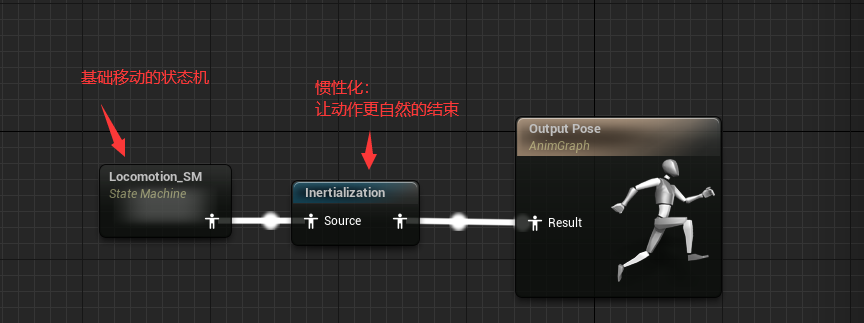

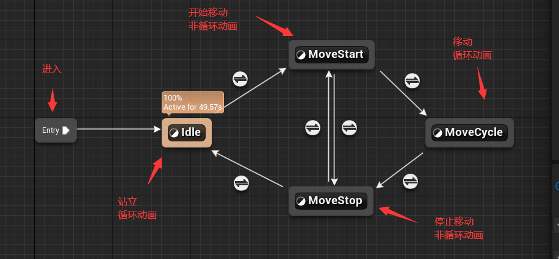

为了让基础移动状态机能够实现状态切换，需要在各个状态之间添加**状态转移条件**

例如：从`Idel`到`MoveStart`，需要判断角色的加速度是否大于0

## BlueprintThreadSafeUpdateAnimation 线程安全更新数据函数

为了获取角色数据，常规做法是从动画蓝图中的`Event Blueprint Update Animation`中获得通过`Try Get Pawn Owner`获得角色对象，进而获取角色数据（该Event每帧执行）

在`Lyra`中，使用函数重载中的`Blueprint Thread Safe Update Animation`（蓝图线程安全更新动画），这个函数在最前面官方文档中提到过

> 在为你的角色类开发动画时，需要注意一些做法，以确保你的动画以最佳性能运行。在Lyra中，我们使用**多线程动画来计算动画值**，而不是使用事件图表。

> 点击 BlueprintThreadSafeUpdateAnimation 函数，你可以查看负责收集动画数据和处理这类计算的函数。

> 使用线程安全函数时，你无法像在事件图表（Event Graph）中那样直接从游戏对象访问数据。例如，如果你尝试为角色的速度复制Gameplay浮点值，则此操作不会被视为线程安全，因此我们建议使用属性访问（Property Access）来就这些情况进行调整。

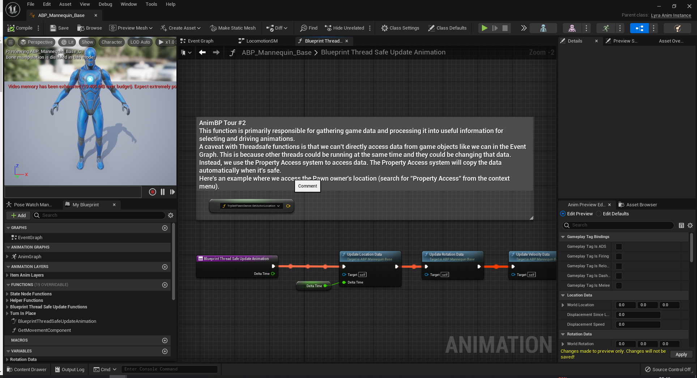

在Lyra的动画蓝图中，对该函数有明确的注释信息

这个函数主要负责收集游戏数据，并将其处理为选择和驱动动画的有用信息  
现场安全函数的一个注意事项是：我们不能像在事件图表中那样直接访问游戏对象的数据。这是因为其他线程在同一时间可能正在改变这些数据。相反，我们使用属性访问系统来访问数据。在安全的情况下，属性访问系统会自动复制数据。

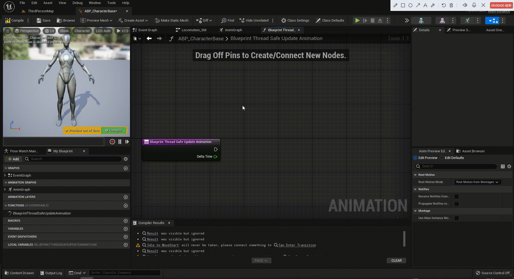

一般来说，不会直接在`BlueprintThreadSafeUpdateAnimation`中编写更新代码，而是调用更新函数(美观)

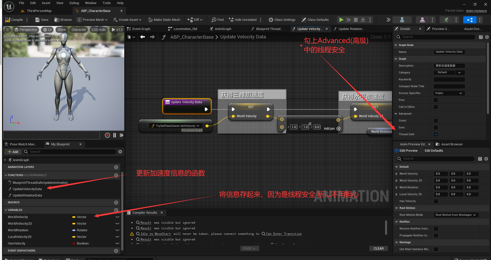

如何向`Property Access`中添加一些**自定义属性**呢？

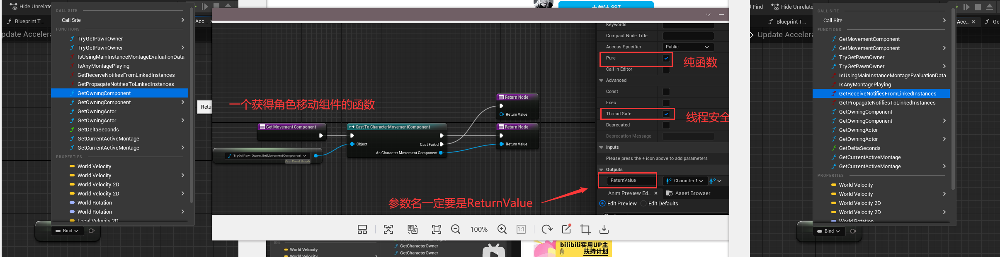

对比上图中的左右两边，发现我们自定义的`GetMovementComponent`纯函数被添加进了`Property Access`中去了

> **重点**：返回值参数名得是`ReturnValue`，纯函数，线程安全

### 共享条件

就是一些相同的判断条件，不需要重复书写，通过`Promote To Shared`来共享判断条件

比如：从`Idel`到`MoveStart`是判断是否存在加速度，从`MoveStop`到`MoveStart`也是判断是否存在加速度，此时这个判断条件就可以共享

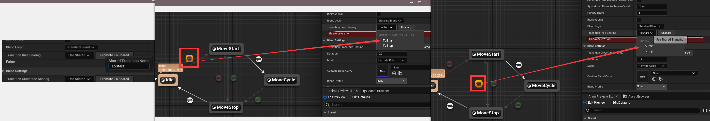

> UE还贴心的用相同的颜色去区分不同的共享条件

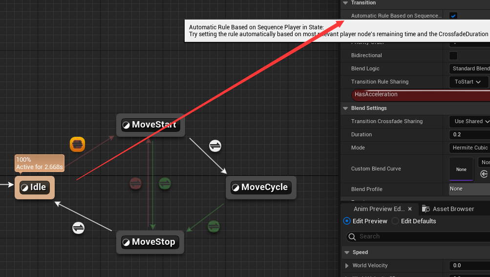

当该动画播放完毕之后会自动跳转到下一个状态

### 动画层接口

新建动画层接口 `ALI_AnimLayerInterface`

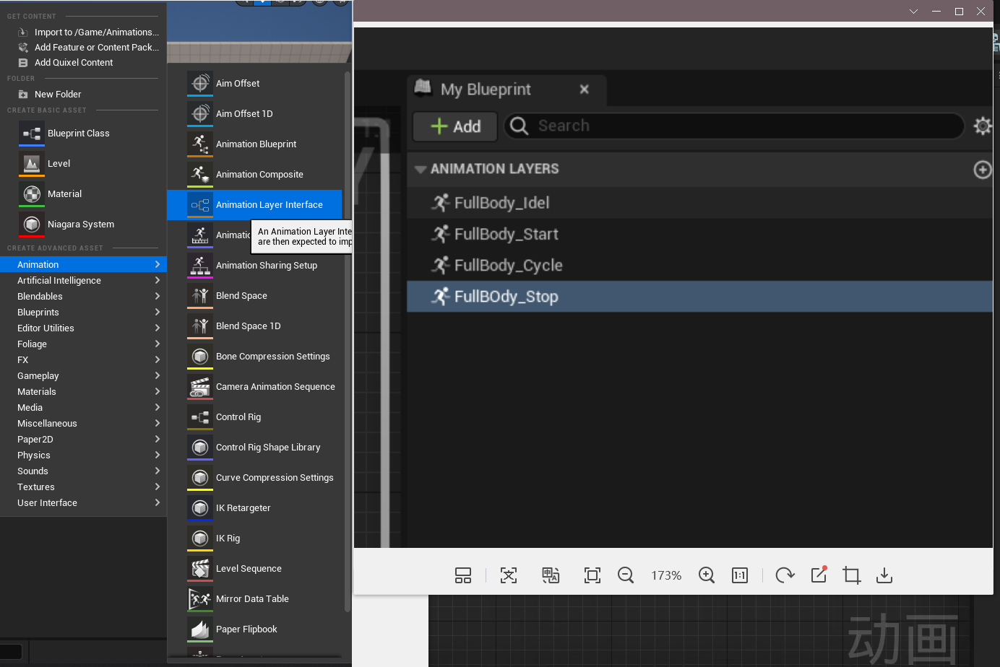

> 如图新建动画层接口

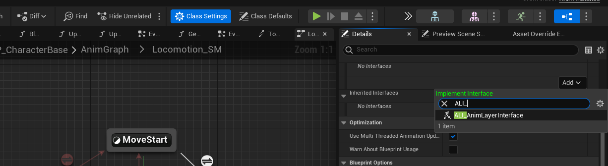

> 在动画蓝图中实现动画层接口

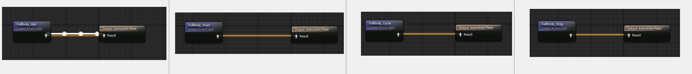

> 给各个状态设置 连上对应的动画层接口 动画

### 新建专门用来实现动画逻辑的动画蓝图

新建一个动画蓝图`ABP_ItemLayerBase`，专门用于实现动画逻辑：动画的动态切换、动画的动态选择、距离匹配等逻辑

与之前创建的`ABP_CharacterBase`相同，使用相同的骨骼，并且也实现`ALI_AnimLayerInterface`动画层接口

而这个动画蓝图不需要实现状态机，只需要专注于动画层即可

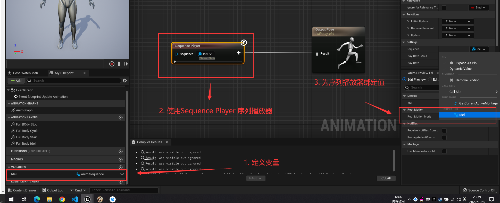

> 通过变量和bind的方式，将`Sequence Player`节点的值与变量绑定，以后修改只需要修改变量默认值即可，无需求改任何节点

同理，对其他三个接口也是相同的操作，定义`Anim Sequence`变量，绑定到`Sequence Player`中

> 注意 **Start** 和 **Stop** 两个状态的`Sequence Player`需要关闭动画循环(默认开启)

此时，基类定义完毕，接下来要做的就是用刚刚新建的`ABP_ItemLayerBase`作为基类，定义真正设置值的子类

比如，这里新建一个`ABP_PistolLayers`子类，表示持手枪的一个动画蓝图

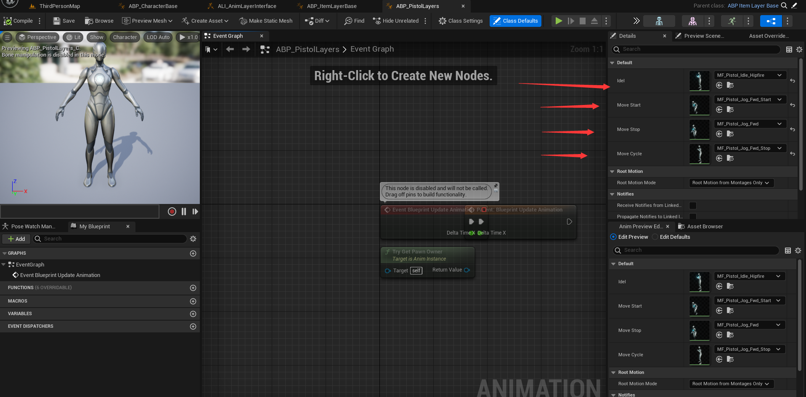

打开之后，右下角可以直接进行动画资源的设置

### 关联动画类图层

这里新建一个Character，设置 `Sekeletal Mesh Component`的骨骼，动画蓝图为前面创建的`ABP_CharacterBase`

此时状态机已经在跑了，但是动态机各个状态只设置了从接口输出动画，并没有设置各个接口的动画资源；动画层蓝图设置了实现了各个接口输出的动画资源，并没有状态机

因此只需要将 `ABP_CharacterBase` 和 `ABP_PistolLayers`关联起来即可

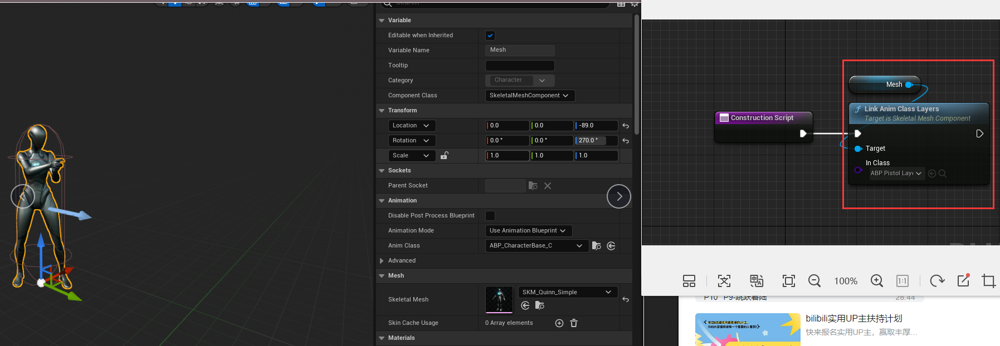

使用`Link Anim Class Layers`节点，绑定动画蓝图和动画层