# Lyra动画蓝图制作

[原版视频](https://www.bilibili.com/video/BV1dT41157pS)

[官方文档](https://docs.unrealengine.com/5.0/zh-CN/animation-in-lyra-sample-game-in-unreal-engine/)

## 基础移动

新建动画蓝图 `ABP_CharacterBase`


为了让基础移动状态机能够实现状态切换，需要在各个状态之间添加**状态转移条件**

例如：从`Idel`到`MoveStart`，需要判断角色的加速度是否大于0

## BlueprintThreadSafeUpdateAnimation 线程安全更新数据函数

为了获取角色数据，常规做法是从动画蓝图中的`Event Blueprint Update Animation`中获得通过`Try Get Pawn Owner`获得角色对象，进而获取角色数据（该Event每帧执行）

在`Lyra`中，使用函数重载中的`Blueprint Thread Safe Update Animation`（蓝图线程安全更新动画），这个函数在最前面官方文档中提到过

> 在为你的角色类开发动画时，需要注意一些做法，以确保你的动画以最佳性能运行。在Lyra中，我们使用**多线程动画来计算动画值**，而不是使用事件图表。

> 点击 BlueprintThreadSafeUpdateAnimation 函数，你可以查看负责收集动画数据和处理这类计算的函数。

> 使用线程安全函数时，你无法像在事件图表（Event Graph）中那样直接从游戏对象访问数据。例如，如果你尝试为角色的速度复制Gameplay浮点值，则此操作不会被视为线程安全，因此我们建议使用属性访问（Property Access）来就这些情况进行调整。


在Lyra的动画蓝图中，对该函数有明确的注释信息

这个函数主要负责收集游戏数据，并将其处理为选择和驱动动画的有用信息  
现场安全函数的一个注意事项是：我们不能像在事件图表中那样直接访问游戏对象的数据。这是因为其他线程在同一时间可能正在改变这些数据。相反，我们使用属性访问系统来访问数据。在安全的情况下，属性访问系统会自动复制数据。


一般来说，不会直接在`BlueprintThreadSafeUpdateAnimation`中编写更新代码，而是调用更新函数(美观)


如何向`Property Access`中添加一些**自定义属性**呢？


对比上图中的左右两边，发现我们自定义的`GetMovementComponent`纯函数被添加进了`Property Access`中去了

> **重点**：返回值参数名得是`ReturnValue`，纯函数，线程安全

### 共享条件

就是一些相同的判断条件，不需要重复书写，通过`Promote To Shared`来共享判断条件

比如：从`Idel`到`MoveStart`是判断是否存在加速度，从`MoveStop`到`MoveStart`也是判断是否存在加速度，此时这个判断条件就可以共享


> UE还贴心的用相同的颜色去区分不同的共享条件


当该动画播放完毕之后会自动跳转到下一个状态

### 动画层接口

新建动画层接口 `ALI_AnimLayerInterface`


> 如图新建动画层接口


> 在动画蓝图中实现动画层接口


> 给各个状态设置 连上对应的动画层接口 动画

### 新建专门用来实现动画逻辑的动画蓝图

新建一个动画蓝图`ABP_ItemLayerBase`，专门用于实现动画逻辑：动画的动态切换、动画的动态选择、距离匹配等逻辑

与之前创建的`ABP_CharacterBase`相同，使用相同的骨骼，并且也实现`ALI_AnimLayerInterface`动画层接口

而这个动画蓝图不需要实现状态机，只需要专注于动画层即可


> 通过变量和bind的方式，将`Sequence Player`节点的值与变量绑定，以后修改只需要修改变量默认值即可，无需求改任何节点

同理，对其他三个接口也是相同的操作，定义`Anim Sequence`变量，绑定到`Sequence Player`中

> 注意 **Start** 和 **Stop** 两个状态的`Sequence Player`需要关闭动画循环(默认开启)

此时，基类定义完毕，接下来要做的就是用刚刚新建的`ABP_ItemLayerBase`作为基类，定义真正设置值的子类

比如，这里新建一个`ABP_PistolLayers`子类，表示持手枪的一个动画蓝图


打开之后，右下角可以直接进行动画资源的设置

### 关联动画类图层

这里新建一个Character，设置 `Sekeletal Mesh Component`的骨骼，动画蓝图为前面创建的`ABP_CharacterBase`

此时状态机已经在跑了，但是动态机各个状态只设置了从接口输出动画，并没有设置各个接口的动画资源；动画层蓝图设置了实现了各个接口输出的动画资源，并没有状态机

因此只需要将 `ABP_CharacterBase` 和 `ABP_PistolLayers`关联起来即可


使用`Link Anim Class Layers`节点，绑定动画蓝图和动画层

## 距离匹配

角色移动的时候，脚步与移速并不可能完美对齐

会使用插件`Animation Locomotion Library`中的一些函数节点

首先是，动画才需要距离匹配，所以需要关注的文件就是`ABP_ItemLayerBase`，这个文件中定义了动作节点会输出的动作文件

然后就是需要确定哪些动作需要做步幅匹配，比如 Start、Stop、Cycle 三个动作就是做步幅匹配的

### Start 起跑动画


这里使用序列求值器来做步幅匹配，重点为**显式时间**，也就是`Explicit Time`，可以用来控制动画当前行进进度


需要注意的就是，这个`SetupStartAnim`函数是绑定在变为相关时触发，也就是状态机行进到该状态时，所以此时需要将显式时间设置为0，从头开始播放动画

如果不在进入状态时将显式时间设置为0，则该动画就不是从头播放，而是从上次做计算时设置的显式时间开始，在当前环境下这是个很明显的错误


然后就是后续更新时绑定函数`UpdateStartAnim`

以`MoveStart`为例，角色是逐渐加速，直到进入行走循环的过程

有一个节点`Advance Time by Distance Matching` 根据位移去计算一个显式时间，在`Lyra`这个项目的`ABP_ItemAnimLayersBase`中相同位置的Update函数对该函数有一段注释

```
AnimBP Tour #9
This is an example of using Distance Matching to ensure that the distance traveled by the Start animation matches the distance traveled by the Pawn owner. This prevents foot sliding by keeping the animation and the motion model in sync.
This effectively controls the play rate of the Start animation. We clamp the effective play rate to prevent the animation from playing too slowly or too quickly.
If the effective play rate is clamped, we will still see some sliding. To fix this, we use Stride Warping later to adjust the pose to correct for the remaining difference.
The Animation Locomotion Library plugin is required to have access to Distance Matching functions.
```

机翻结果为：

```
这是一个使用 "Distance Matching" 确保 "Start" 动画移动的距离与典当所有者移动的距离相匹配的示例。这可以通过保持动画和运动模型同步来防止脚滑动。
这可以有效地控制“开始”动画的播放速率。我们限制有效播放速率，以防止动画播放过慢或过快。
如果有效播放速率被限制，我们仍然会看到一些滑动。为了解决这个问题，我们稍后使用“步幅扭曲”来调整姿势，以纠正剩余的差异。
动画运动库插件需要访问距离匹配功能。
```


通过上图可以看到`Advance Time by Distance Matching`的几个参数，前两个可以直接获得，第三个`Distance Traveled`每帧位移，这个位移需要到基础动画蓝图，也就是`ABP_CharacterBase`中去计算，并且将值封装到`Property Access`这种线程安全的获取方式中

在`ABP_CharacterBase`中新增线程安全函数`UpdateLocationData`，新增变量`WorldLocation`记录上一帧坐标，新增变量`DisplacementSinceLastUpdate`计算距离变化，新增变量`bIsFirstUpdate`用于判断是否是第一次计算(初始值为true)


随后记得把`UpdateLocationData`函数添加到`Blueprint Thread Safe Update Animation`中，并将`bIsFirstUpdate`设置为false

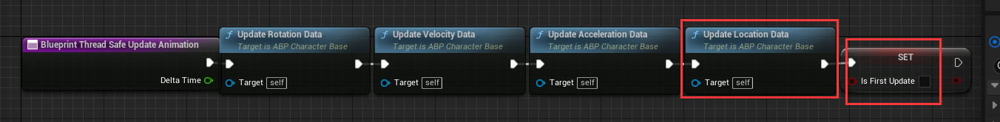

此时我们通过`UpdateLocationData`函数计算得到了`DisplacementSinceLastUpdate`变量，接下来就是编写 纯函数、线程安全、返回值参数名为RetureValue 的获取该值的函数

不过跟上面获得移动组件的PropertyAccess函数不同，由于这个`DisplacementSinceLastUpdate`定义在`ABP_CharacterBase`中，但是使用却是在`ABP_ItemLayerBase`中，所以需要在`ABP_ItemLayerBase`中定义这样的获取函数

为了一劳永逸，**直接定义获得动画蓝图的函数**即可

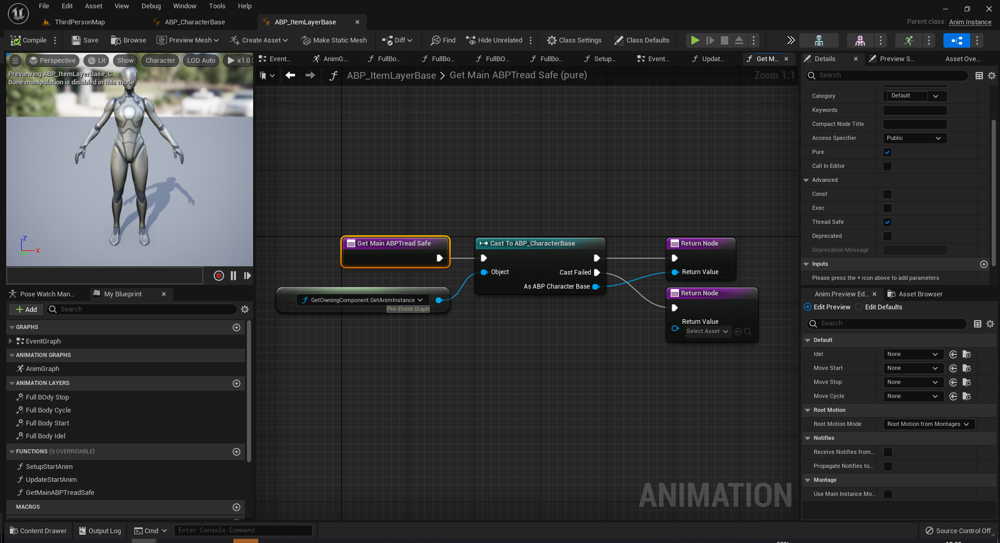

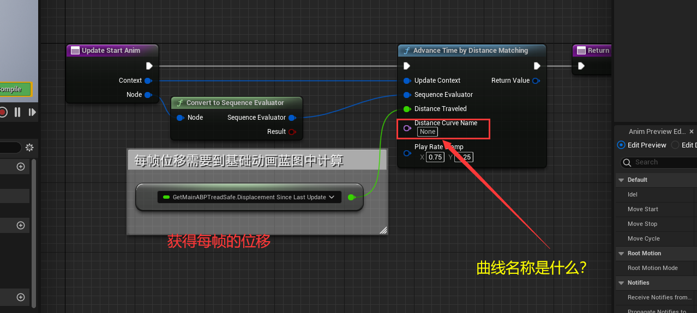

**曲线名称是什么？**

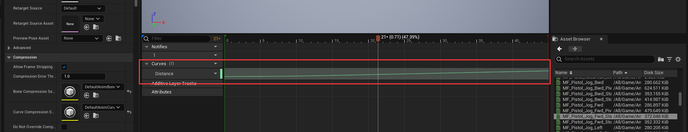

以官方提供的lyra动画`MF_Pistol_Jog_Fwd_Start`为例，下面的Gif图片展示了如何一键添加距离曲线，这个是插件提供的功能

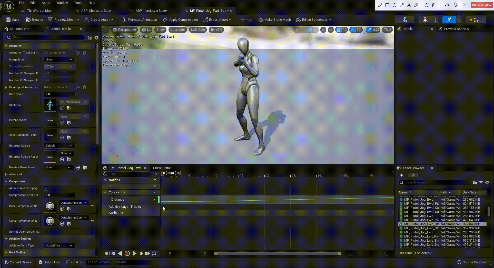

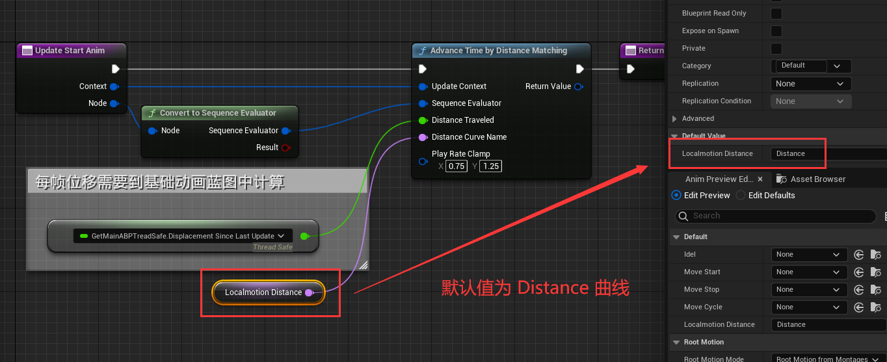

那么`Start`起跑动画就做完了，接下来要做的就是`Cycle`跑动的循环动画

### Cycle 跑步循环动画

起跑动画做距离匹配用的是**动态调整动画显式时间**的，但是循环跑动动画是不能通过调整显式时间来做距离匹配的，因为它是循环动画，去调整显式时间(播放进度)是没有意义的，所以针对循环动画要调整的是**播放速率(Play Rate)**

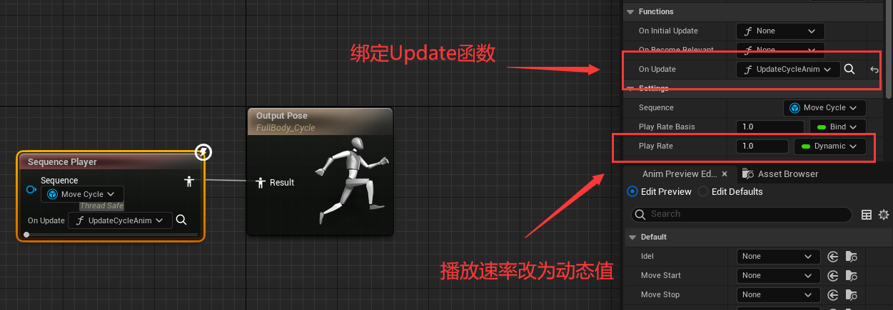

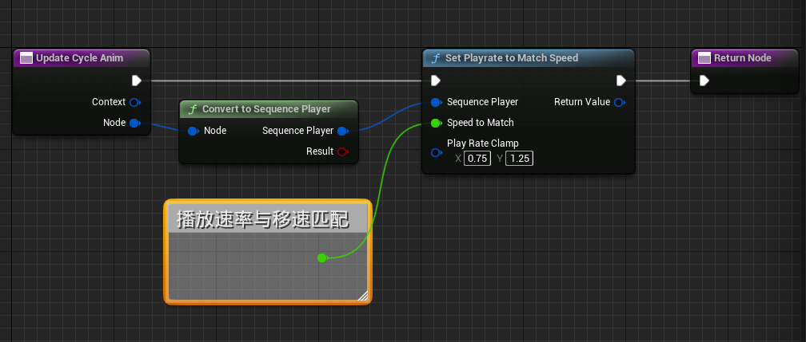

Cycle的播放速率与移动速度相关，所以老样子要在`ABP_CharacterBase`中添加移速相关的变量，方便`ABP_ItemLayerBase`获取

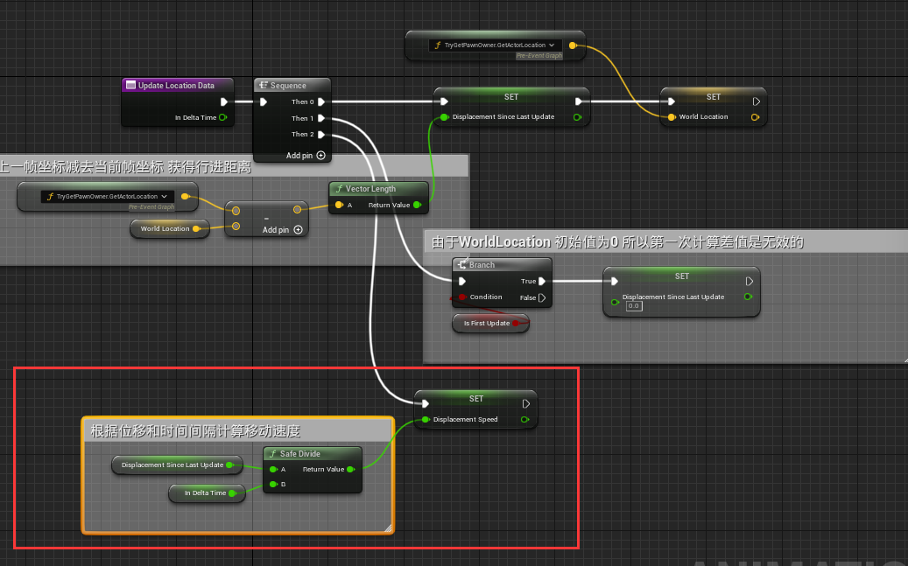

在计算每帧位移的时候，也可以顺便计算每帧的移动速度，只需要使用位移除以DeltaTime即可

> 这里使用`Safe Divide`其实就是除以的意思  
> 别忘了在`Blueprint Thread Safe Update Animation`函数中为`UpdateLocationData`传入**DeltaTime**参数

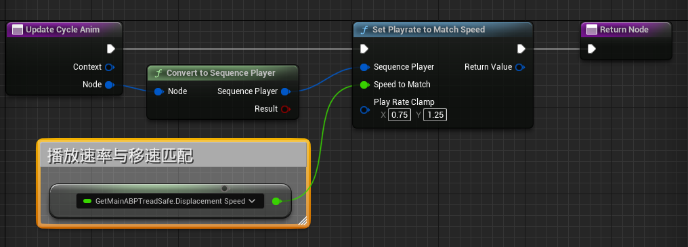

### Stop 停止动画

与Start状态部分相同，使用序列求值器(Sequence Evaluator)

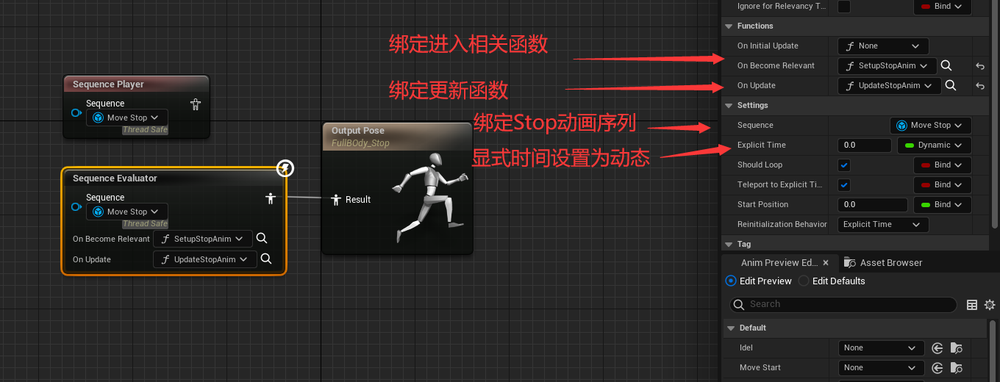

同样要设置进入相关状态时，显式时间为0

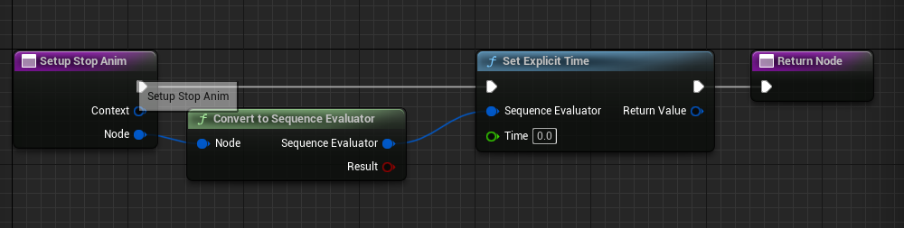

然后就是处理Update函数了

**什么时候要播放Stop动画？**应该是**有速度**，但是**没有加速度**的情况

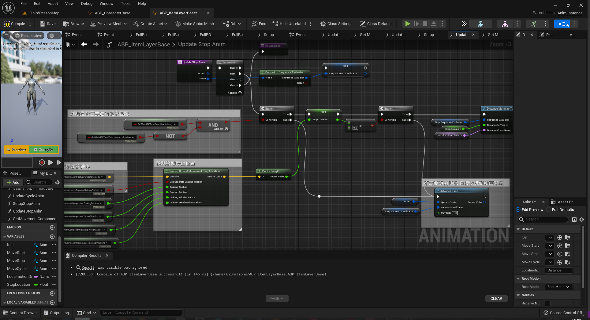

1. 首先就是是否播放Stop动画的判断：有速度(`HasVelocity`)和无加速度(`HasAcceleration`)，两个参数封装在动画蓝图`ABP_CharacterBase`中，所以可以用前面定义的获得动画蓝图的`Property Access`获得

2. 使用`Predic Ground Movement Stop Location`计算移动停止的坐标，该函数的参数都封装在`MovementComponent`中，所以需要写一个获得`Character Movement`的`Property Access`函数

3. 这里获得的速度是**上一帧**计算得到的速度

4. 这里额外判断的一下**距离停止坐标的距离是否大于0**，大于0才需要做距离匹配

5. 当不需要做距离匹配的时候，直接将动画加速到结束即可(`Play Rate` = 1)

### 问题解决

通过上面的一系列操作，确实得到了一个基本满足距离匹配的动画蓝图

但是当打开`output log`，会发现很多的警告

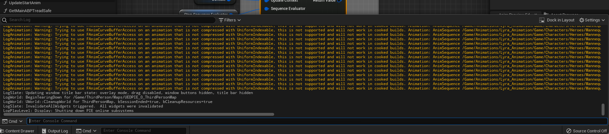

这个是因为动画的**曲线压缩设置**不匹配导致

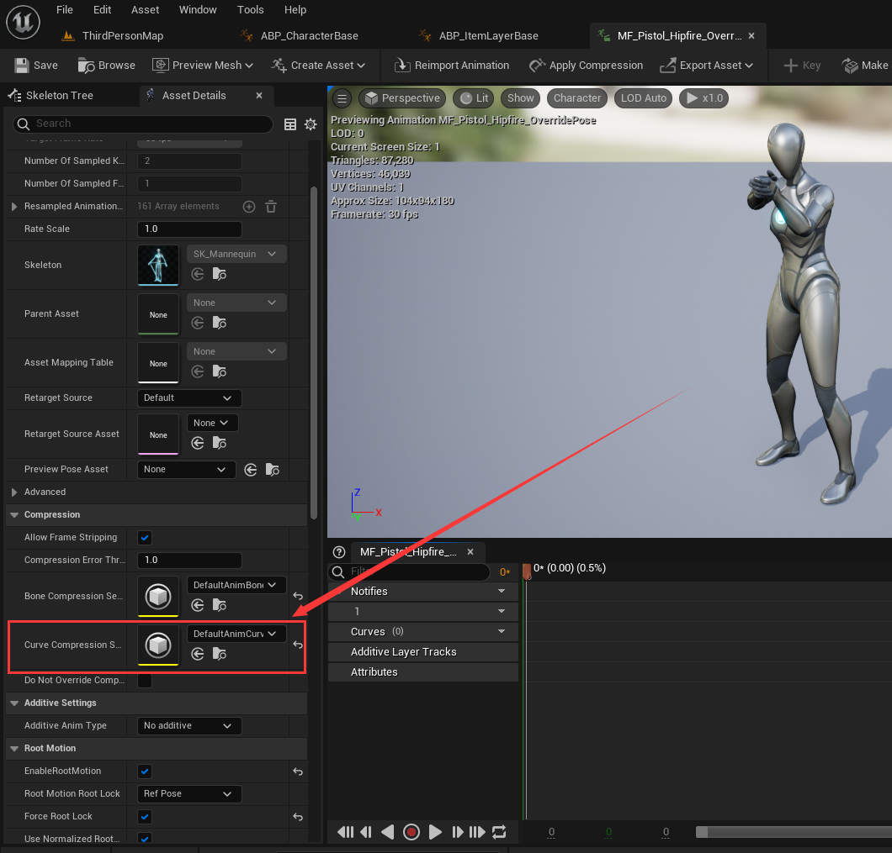

新建基类为`Curve Compression Settings`为基类的`UniformIndexAnimCurveCompressionSettings`文件，设置其`Codec`为`Uniform Indexable`

随后将所有的动画的曲线压缩设置替换为`UniformIndexAnimCurveCompressionSettings`


> Gif展示如何批量设置

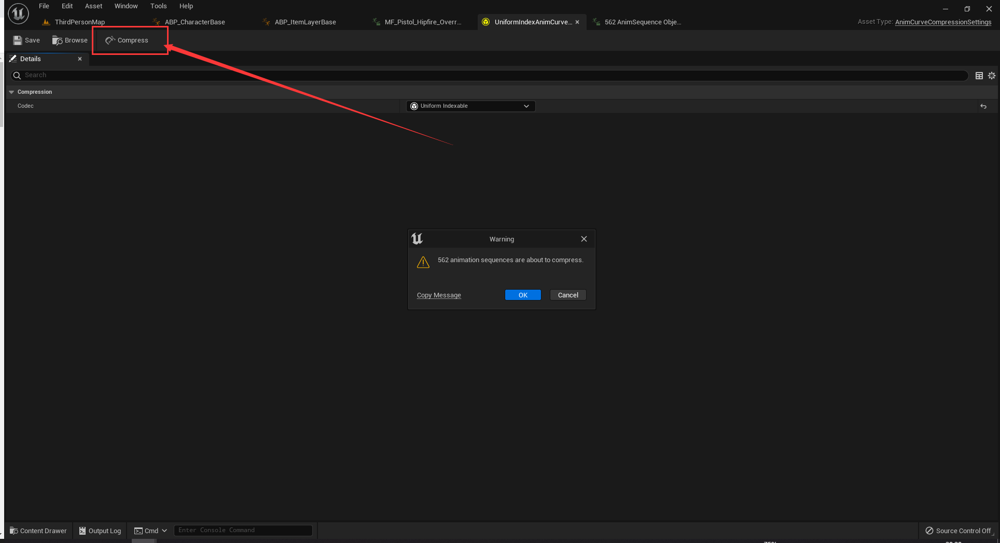

最后点击压缩即可，警告解决

## 步幅匹配

步幅匹配就是 移动速度越快，步子迈的越开；移动速度越慢，步子迈的越小

使用`Stride Warping`步幅扭曲节点来做步幅匹配

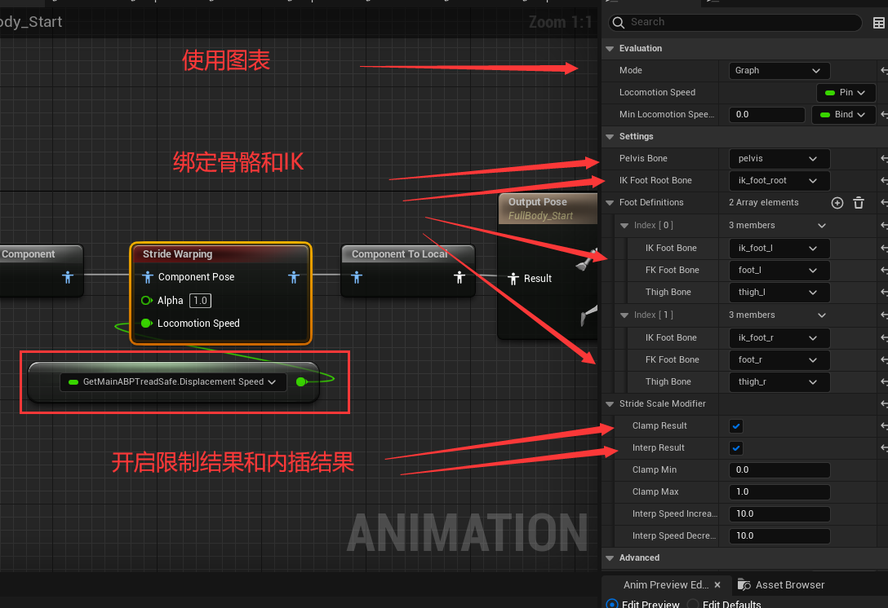

随后将该节点在Start和Cycle中使用，Stop状态只做距离匹配一般就够了不用步幅匹配 

可以在角色的`Character Movement`中设置最大移动速度观察不同的效果

**最大移速为200时**

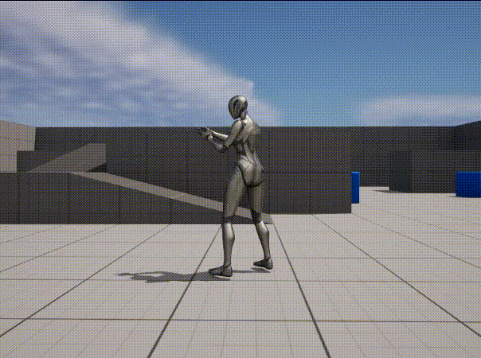

**最大移速为500时**

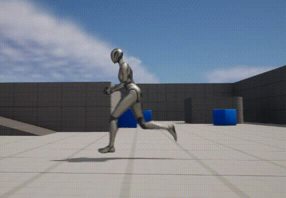

## 同步组

为了让两个状态的动画能够平滑过度，需要引入同步组

这里的平滑过渡指的是左右脚匹配

这里以Start和Cycle为例


使用`SyncMarkerAnimModifier`来自动添加左右脚的标记，需要给Start的动作和Cycle的动作都进行这样的标记处理

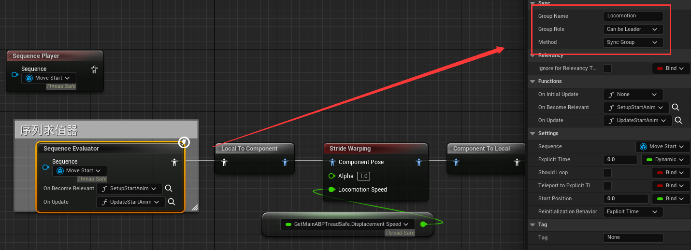

将`Start`和`Cycle`的序列都进行上图设置，`GroupName`必须相同

## 移动的八方向